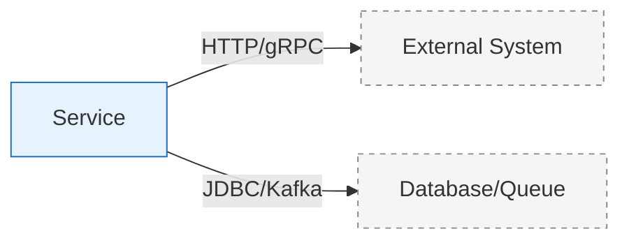
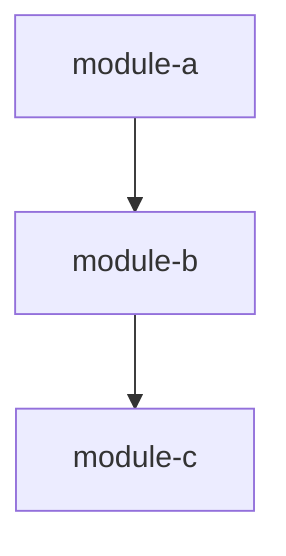
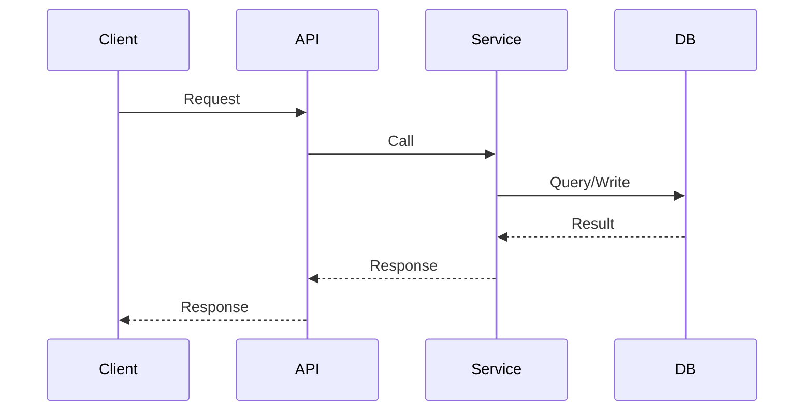

# Mermaid Diagram Templates

## Component Diagram (Service + External Dependencies)

```mermaid
flowchart LR
  S[Service]:::svc
  E1[External System]:::ext
  E2[Database/Queue]:::ext
  S -->|HTTP/gRPC| E1
  S -->|JDBC/Kafka| E2

  classDef svc fill:#e6f3ff,stroke:#1b6ec2,stroke-width:1px;
  classDef ext fill:#f5f5f5,stroke:#888,stroke-width:1px,stroke-dasharray: 4 4;
```

## Module Dependency Diagram (If Multi-module)

```mermaid
graph TD
  A[module-a] --> B[module-b]
  B --> C[module-c]
```

## Sequence Diagram (Critical Business Flow)

```mermaid
sequenceDiagram
  participant Client
  participant API
  participant Service
  participant DB
  Client->>API: Request
  API->>Service: Call
  Service->>DB: Query/Write
  DB-->>Service: Result
  Service-->>API: Response
  API-->>Client: Response
```
