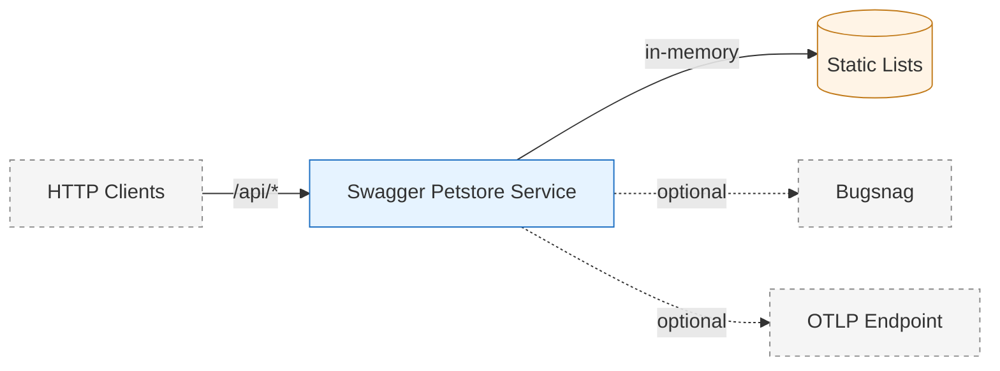
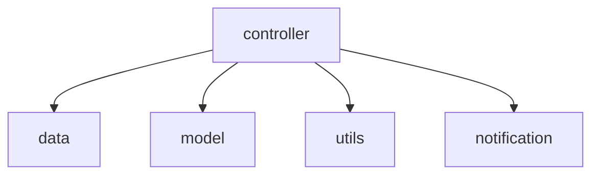
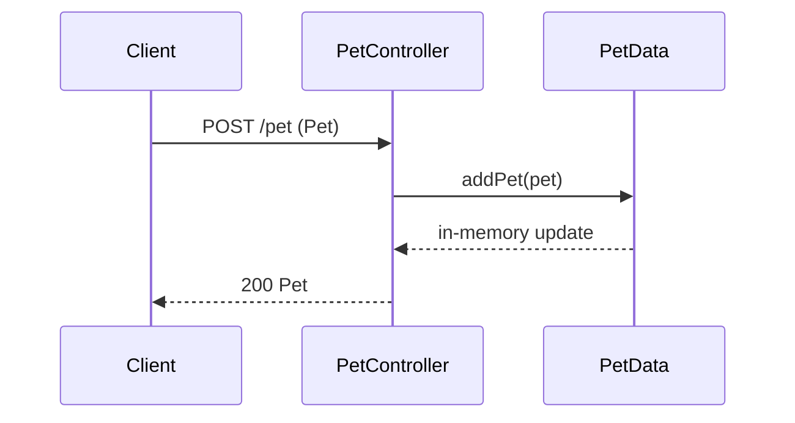
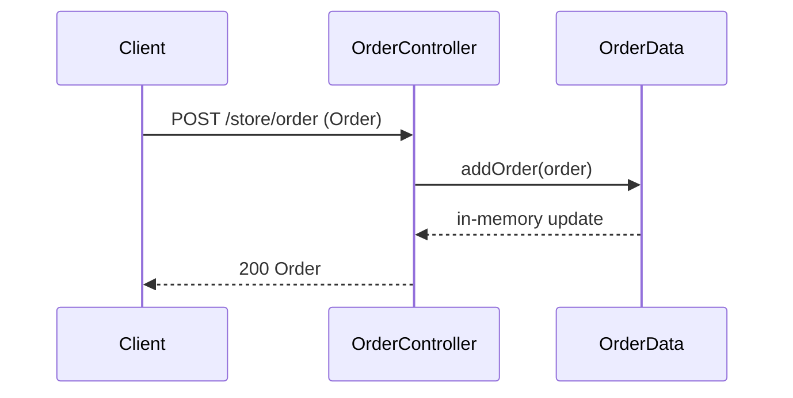
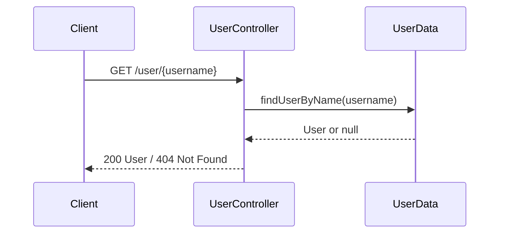

# PROJECT_PROFILE.md

## Cover
- Project/Service name: swagger-petstore (Maven `artifactId`) — Evidence: `swagger-petstore-master/pom.xml`
- Report version: v2026-01-31-r1-petstore
- Date: 2026-01-31
- Scope (analyzed): `pom.xml`, `Dockerfile`, `Dockerfile-telemetry`, `inflector.yaml`, `README.md`, `src/main/java/**`, `src/main/resources/openapi.yaml`, `src/main/webapp/**`, `CI/**`
- Intended audience: Operations/SRE

## 0. Executive Summary
### What this service is (type and role)
- **Type**: Java web application packaged as a WAR, deployed on Jetty via Jetty runner; JAX‑RS + Swagger Inflector runtime. Evidence: `swagger-petstore-master/pom.xml` (packaging `war`), `swagger-petstore-master/src/main/webapp/WEB-INF/web.xml` (Jersey servlet + OpenAPI Inflector), `swagger-petstore-master/Dockerfile` (jetty-runner)
- **Role**: Implements the Swagger Petstore sample API defined by OpenAPI spec; exposes pet, store/order, and user APIs for demo/testing. Evidence: `swagger-petstore-master/README.md`, `swagger-petstore-master/src/main/resources/openapi.yaml`

### What it does in the old environment
- The README states this sample is hosted at `https://petstore3.swagger.io` and provides an API UI at the root path. Evidence: `swagger-petstore-master/README.md`

### Top 10 operationally relevant findings
1) Packaged as a WAR and run via Jetty (`jetty-runner.jar`) on port **8080**. Evidence: `swagger-petstore-master/pom.xml`, `swagger-petstore-master/Dockerfile`
2) Runtime is **not Spring Boot**; uses Jersey Servlet + Swagger Inflector to map OpenAPI operations. Evidence: `swagger-petstore-master/src/main/webapp/WEB-INF/web.xml`, `swagger-petstore-master/inflector.yaml`
3) Base API path is under `/api` (servlet mapping + inflector rootPath). Evidence: `swagger-petstore-master/src/main/webapp/WEB-INF/web.xml`, `swagger-petstore-master/inflector.yaml`
4) Business data is **in-memory** (static lists), no external database. Evidence: `swagger-petstore-master/src/main/java/io/swagger/petstore/data/PetData.java`, `.../OrderData.java`, `.../UserData.java`
5) OpenAPI spec defines **pet**, **store/order**, and **user** operations with security schemes (OAuth2 + apiKey). Evidence: `swagger-petstore-master/src/main/resources/openapi.yaml`
6) Auth enforcement is **Unknown** (no auth checks observed in controllers; searched `src/main/java/io/swagger/petstore/controller/*.java`). Security is declared in OpenAPI. Evidence: `swagger-petstore-master/src/main/java/io/swagger/petstore/controller/*.java`, `swagger-petstore-master/src/main/resources/openapi.yaml`
7) Optional error notification integration via Bugsnag (env var `BUGSNAG_API_KEY`) and optional notifier class via `notifierClass`. Evidence: `swagger-petstore-master/src/main/java/io/swagger/petstore/notification/BugSnagNotifier.java`, `.../controller/PetController.java`
8) Optional OpenTelemetry export in `Dockerfile-telemetry` with OTLP to Bugsnag endpoint. Evidence: `swagger-petstore-master/Dockerfile-telemetry`
9) Health endpoint is **Unknown** (no health/actuator endpoints found; searched `src/main/java` and `openapi.yaml`). README suggests using `/api/v3/openapi.json` for availability. Evidence: `swagger-petstore-master/README.md`
10) Tests are effectively absent (empty test class); CI/test rigor is Unknown. Evidence: `swagger-petstore-master/src/test/java/ip/swagger/petstore/PetStoreTest.java`

### Integration Snapshot (top 5)
1) **Inbound HTTP clients** → API under `/api/*` (JAX‑RS + OpenAPI Inflector). Evidence: `swagger-petstore-master/src/main/webapp/WEB-INF/web.xml`, `swagger-petstore-master/inflector.yaml`
2) **Swagger/OpenAPI consumers** (spec consumers) → OpenAPI definition in `openapi.yaml`. Evidence: `swagger-petstore-master/src/main/resources/openapi.yaml`
3) **OAuth2 metadata** → Authorization URL can be rewritten via `SWAGGER_OAUTH_HOST`. Evidence: `swagger-petstore-master/src/main/java/io/swagger/petstore/utils/HandleAuthUrlProcessor.java`
4) **Bugsnag** (optional) → error notifications via `BUGSNAG_API_KEY`. Evidence: `swagger-petstore-master/src/main/java/io/swagger/petstore/notification/BugSnagNotifier.java`
5) **OTel → Bugsnag OTLP** (optional) via telemetry Dockerfile. Evidence: `swagger-petstore-master/Dockerfile-telemetry`

### Production Readiness Score (0–100)
**Score: 42 / 100** (sample/demo-grade; not production-hardened)

| Dimension | Score | Rationale (Evidence Anchor) |
|---|---:|---|
| Source completeness | 70 | Full API + controllers present. Evidence: `swagger-petstore-master/src/main/java/io/swagger/petstore/controller/*.java`, `swagger-petstore-master/src/main/resources/openapi.yaml` |
| Build & packaging | 65 | Maven build + WAR + Dockerfile present. Evidence: `swagger-petstore-master/pom.xml`, `swagger-petstore-master/Dockerfile` |
| Config & secrets hygiene | 30 | Minimal env vars; no config hierarchy. Evidence: `swagger-petstore-master/inflector.yaml`, `swagger-petstore-master/src/main/java/io/swagger/petstore/utils/HandleAuthUrlProcessor.java`, `.../controller/PetController.java` |
| Kubernetes readiness | 35 | Dockerfile exists; no probes or k8s manifests. Evidence: `swagger-petstore-master/Dockerfile`; Unknown search: repo root for `helm/`, `kustomize/`, `*.yaml` manifests |
| Observability | 40 | Optional Bugsnag + OTel; no structured app logging. Evidence: `swagger-petstore-master/Dockerfile-telemetry`, `.../notification/BugSnagNotifier.java` |
| Testing signals (reference only) | 5 | Empty test class only. Evidence: `swagger-petstore-master/src/test/java/ip/swagger/petstore/PetStoreTest.java` |
| Docs & runbook | 50 | README provides run commands and endpoints. Evidence: `swagger-petstore-master/README.md` |

### Top 5 actions to deploy safely in a new K8s environment
1) Add health endpoints or decide on a health proxy (no native health endpoints found). Evidence: `swagger-petstore-master/src/main/java/io/swagger/petstore/controller/*.java` (no health), `swagger-petstore-master/README.md` (suggested `/api/v3/openapi.json`)
2) Decide whether to enable Bugsnag/OTel and provide `BUGSNAG_API_KEY` if used. Evidence: `swagger-petstore-master/src/main/java/io/swagger/petstore/notification/BugSnagNotifier.java`, `swagger-petstore-master/Dockerfile-telemetry`
3) Plan for **statelessness**: data is in-memory and lost on restart. Evidence: `swagger-petstore-master/src/main/java/io/swagger/petstore/data/*.java`
4) Define ingress paths and routing for `/api/*` and UI root `/`. Evidence: `swagger-petstore-master/src/main/webapp/WEB-INF/web.xml`, `swagger-petstore-master/src/main/webapp/index.html`
5) Review OpenAPI security schemes vs. actual enforcement (code does not enforce). Evidence: `swagger-petstore-master/src/main/resources/openapi.yaml`, `swagger-petstore-master/src/main/java/io/swagger/petstore/controller/*.java`

## 1. Reader Guide
- Ops/SRE: Sections 0, 8, 9, 11, 12
- Integration/Platform: Sections 4, 6, 8
- Developers: Sections 2, 3, 5

## 2. Repository Map & Service Identity
### Repository Map
- Single Maven module with WAR packaging. Evidence: `swagger-petstore-master/pom.xml`
- Source roots: `src/main/java`, generated sources in `src/gen/java`. Evidence: `swagger-petstore-master/pom.xml` (build-helper add-source)

### Build Tool / Java Version / Frameworks
- Build tool: Maven. Evidence: `swagger-petstore-master/pom.xml`
- Java version: 1.8 (source/target). Evidence: `swagger-petstore-master/pom.xml` (maven-compiler-plugin)
- Runtime framework: Jersey Servlet + Swagger Inflector (OpenAPI-driven). Evidence: `swagger-petstore-master/src/main/webapp/WEB-INF/web.xml`, `swagger-petstore-master/inflector.yaml`, `swagger-petstore-master/pom.xml` (swagger-inflector dependency)

### Runtime Entrypoints
- WAR deployed via Jetty runner: `java -jar ... jetty-runner.jar ... server.war`. Evidence: `swagger-petstore-master/Dockerfile`
- Servlet mapping: `/api/*` via Jersey + OpenAPI Inflector. Evidence: `swagger-petstore-master/src/main/webapp/WEB-INF/web.xml`

### Service Type Determination
- **Standalone HTTP service** (not library/batch): JAX‑RS servlet, exposed on port 8080, provides REST APIs. Evidence: `swagger-petstore-master/src/main/webapp/WEB-INF/web.xml`, `swagger-petstore-master/Dockerfile`

### Architecture Baseline (from absorbed skills)
- From `java-architect`: architecture analysis, domain design, data layer focus, production readiness checklist. Evidence: `~/.agents/skills/java-architect/SKILL.md`
- From `java-reviewer`: Java idioms, exception handling, resource management, null safety as quality signals (non-test only). Evidence: `~/.cursor/skills/java-reviewer/SKILL.md`

## 3. What It Does — Functional Role & Capabilities
**Core capabilities (derived from controllers + OpenAPI):**
- Manage pets: add, update, delete, find by status/tags, fetch by id. Evidence: `swagger-petstore-master/src/main/resources/openapi.yaml` (paths under `/pet`), `swagger-petstore-master/src/main/java/io/swagger/petstore/controller/PetController.java`
- Manage orders: place order, fetch order, delete order, inventory by status. Evidence: `swagger-petstore-master/src/main/resources/openapi.yaml` (paths under `/store`), `swagger-petstore-master/src/main/java/io/swagger/petstore/controller/OrderController.java`
- Manage users: create, update, delete, login/logout, fetch by username. Evidence: `swagger-petstore-master/src/main/resources/openapi.yaml` (paths under `/user`), `swagger-petstore-master/src/main/java/io/swagger/petstore/controller/UserController.java`

**Inputs/Outputs & Side Effects**
- Inputs: HTTP requests mapped from OpenAPI operations. Evidence: `swagger-petstore-master/src/main/resources/openapi.yaml`, `swagger-petstore-master/src/main/webapp/WEB-INF/web.xml`
- Outputs: JSON/XML/YAML responses based on Accept header. Evidence: `swagger-petstore-master/src/main/java/io/swagger/petstore/utils/Util.java`
- Side effects: In-memory data mutations on static lists for pets/orders/users. Evidence: `swagger-petstore-master/src/main/java/io/swagger/petstore/data/PetData.java`, `.../OrderData.java`, `.../UserData.java`

**Data ownership**
- Owns in-memory pet/order/user data; no external datastore. Evidence: `swagger-petstore-master/src/main/java/io/swagger/petstore/data/*.java`

## 4. System Context & Interactions (Most Important)
### 4.1 Integration Matrix
| Partner/System | Direction | Protocol | Auth | Endpoints/Topics | Payload/Schema | Resilience | Evidence |
|---|---|---|---|---|---|---|---|
| API Clients | Inbound | HTTP (JAX‑RS) | Declared in OpenAPI (OAuth2/apiKey) but enforcement unknown | `/api/*` | `openapi.yaml` | No retries/timeouts evidenced | `swagger-petstore-master/src/main/webapp/WEB-INF/web.xml`, `swagger-petstore-master/src/main/resources/openapi.yaml`, `swagger-petstore-master/src/main/java/io/swagger/petstore/controller/*.java` |
| Bugsnag (optional) | Outbound | HTTPS (SDK) | `BUGSNAG_API_KEY` | N/A | N/A | No retry evidence | `swagger-petstore-master/src/main/java/io/swagger/petstore/notification/BugSnagNotifier.java` |
| OAuth2 metadata (spec only) | Outbound (spec metadata) | HTTPS (auth URL in spec) | N/A | `authorizationUrl` | `openapi.yaml` | N/A | `swagger-petstore-master/src/main/resources/openapi.yaml`, `swagger-petstore-master/src/main/java/io/swagger/petstore/utils/HandleAuthUrlProcessor.java` |
| OTel → Bugsnag OTLP (optional) | Outbound | OTLP/HTTP | `BUGSNAG_API_KEY` | OTLP endpoint | N/A | No retry evidence | `swagger-petstore-master/Dockerfile-telemetry` |

### 4.2 Mermaid Diagrams
**Component Diagram**


**Module/Package Dependency Diagram** (single module; key packages)


### 4.3 Contract Surfaces
**REST endpoints grouped by controller (from OpenAPI `operationId` mapping):**
- **PetController**: `updatePet`, `addPet`, `findPetsByStatus`, `findPetsByTags`, `getPetById`, `updatePetWithForm`, `deletePet`, `uploadFile`. Evidence: `swagger-petstore-master/src/main/resources/openapi.yaml` (operationId), `swagger-petstore-master/src/main/java/io/swagger/petstore/controller/PetController.java`
- **OrderController**: `getInventory`, `placeOrder`, `getOrderById`, `deleteOrder`. Evidence: `swagger-petstore-master/src/main/resources/openapi.yaml`, `swagger-petstore-master/src/main/java/io/swagger/petstore/controller/OrderController.java`
- **UserController**: `createUser`, `createUsersWithListInput`, `loginUser`, `logoutUser`, `getUserByName`, `updateUser`, `deleteUser`. Evidence: `swagger-petstore-master/src/main/resources/openapi.yaml`, `swagger-petstore-master/src/main/java/io/swagger/petstore/controller/UserController.java`

**Messaging/Async**: Unknown (Not Found in Repo). Searched: `src/main/java`, `src/main/resources` for Kafka/Rabbit/Queue keywords.

## 5. Critical Business Flows (3–5)
### Flow 1: Add Pet
- **Trigger**: `POST /pet` (`operationId: addPet`) — Evidence: `swagger-petstore-master/src/main/resources/openapi.yaml`
- **Call chain**: `PetController#addPet` → `PetData#addPet` → Response. Evidence: `swagger-petstore-master/src/main/java/io/swagger/petstore/controller/PetController.java`, `.../data/PetData.java`
- **Data read/write**: Writes to static in-memory list `pets`. Evidence: `swagger-petstore-master/src/main/java/io/swagger/petstore/data/PetData.java`
- **External interactions**: None evidenced.
- **Failure modes**: 400 when pet missing. Evidence: `swagger-petstore-master/src/main/java/io/swagger/petstore/controller/PetController.java`



### Flow 2: Place Order
- **Trigger**: `POST /store/order` (`operationId: placeOrder`) — Evidence: `swagger-petstore-master/src/main/resources/openapi.yaml`
- **Call chain**: `OrderController#placeOrder` → `OrderData#addOrder`. Evidence: `swagger-petstore-master/src/main/java/io/swagger/petstore/controller/OrderController.java`, `.../data/OrderData.java`
- **Data read/write**: Writes to static in-memory list `orders`. Evidence: `swagger-petstore-master/src/main/java/io/swagger/petstore/data/OrderData.java`
- **External interactions**: None evidenced.
- **Failure modes**: 400 when order missing. Evidence: `swagger-petstore-master/src/main/java/io/swagger/petstore/controller/OrderController.java`



### Flow 3: Get User by Username
- **Trigger**: `GET /user/{username}` (`operationId: getUserByName`) — Evidence: `swagger-petstore-master/src/main/resources/openapi.yaml`
- **Call chain**: `UserController#getUserByName` → `UserData#findUserByName`. Evidence: `swagger-petstore-master/src/main/java/io/swagger/petstore/controller/UserController.java`, `.../data/UserData.java`
- **Data read/write**: Reads from static in-memory list `users`. Evidence: `swagger-petstore-master/src/main/java/io/swagger/petstore/data/UserData.java`
- **External interactions**: None evidenced.
- **Failure modes**: 400 when username missing, 404 when user not found. Evidence: `swagger-petstore-master/src/main/java/io/swagger/petstore/controller/UserController.java`



## 6. Configuration Model & Environment Mapping
**Config sources & precedence**
- `inflector.yaml` defines `controllerPackage`, `modelPackage`, `swaggerUrl`, `rootPath`, and processors. Evidence: `swagger-petstore-master/inflector.yaml`
- Environment variables used at runtime:
  - `notifierClass` to instantiate `Notifier` implementation. Evidence: `swagger-petstore-master/src/main/java/io/swagger/petstore/controller/PetController.java`
  - `BUGSNAG_API_KEY` for Bugsnag. Evidence: `swagger-petstore-master/src/main/java/io/swagger/petstore/notification/BugSnagNotifier.java`
  - `SWAGGER_OAUTH_HOST` to rewrite OpenAPI auth URL. Evidence: `swagger-petstore-master/src/main/java/io/swagger/petstore/utils/HandleAuthUrlProcessor.java`
- System property `swaggerUrl` is passed in Docker CMD. Evidence: `swagger-petstore-master/Dockerfile`

**Config inventory (ops-focused)**
| Key | Meaning | Default | Required? | Where Used | Environment Relevance | Evidence |
|---|---|---|---|---|---|---|
| `notifierClass` | Notifier implementation class | None | Optional | `PetController` constructor | Optional error notification | `.../controller/PetController.java` |
| `BUGSNAG_API_KEY` | Bugsnag auth key | None | Optional | `BugSnagNotifier#init` | Observability | `.../notification/BugSnagNotifier.java` |
| `SWAGGER_OAUTH_HOST` | OAuth auth URL override for spec | None | Optional | `HandleAuthUrlProcessor#process` | Spec metadata | `.../utils/HandleAuthUrlProcessor.java` |
| `swaggerUrl` (system property) | OpenAPI spec location | `openapi.yaml` (in Docker CMD) | Required for CMD | Jetty runner args | Startup | `swagger-petstore-master/Dockerfile` |

## 7. Data Layer (Ops-focused)
- **Datastore**: In-memory static lists (no external database). Evidence: `swagger-petstore-master/src/main/java/io/swagger/petstore/data/*.java`
- **Migrations**: Unknown (Not Found in Repo). Searched: repo root for `db/migration`, `liquibase`, `flyway`.
- **Connection pooling**: Unknown (Not Found in Repo). Searched: `src/main/java`, `pom.xml` for JDBC pool libs.
- **Operational risks**: Data resets on restart; not durable. Evidence: `swagger-petstore-master/src/main/java/io/swagger/petstore/data/*.java`

## 8. Deployment & Kubernetes (Priority 3)
- **Docker assets**: `Dockerfile` and `Dockerfile-telemetry` exist. Evidence: `swagger-petstore-master/Dockerfile`, `swagger-petstore-master/Dockerfile-telemetry`
- **K8s assets**: Unknown (Not Found in Repo). Searched: repo root for `helm/`, `kustomize/`, `*.yaml` manifests.
- **Container port**: 8080. Evidence: `swagger-petstore-master/Dockerfile` (`EXPOSE 8080`)
- **Context path**: `/api/*` (servlet mapping) and root `/` for UI. Evidence: `swagger-petstore-master/src/main/webapp/WEB-INF/web.xml`, `swagger-petstore-master/src/main/webapp/index.html`
- **Probes**: Unknown (no explicit health endpoint). Searched: controllers and OpenAPI for health/actuator endpoints.
- **Graceful shutdown**: Unknown (no explicit shutdown hooks). Searched: `src/main/java` for `@PreDestroy`, `ShutdownHook`.
- **External dependencies**: Optional Bugsnag/OTel. Evidence: `swagger-petstore-master/src/main/java/io/swagger/petstore/notification/BugSnagNotifier.java`, `swagger-petstore-master/Dockerfile-telemetry`

**K8s deployment blueprint (placeholders)**
```yaml
apiVersion: apps/v1
kind: Deployment
metadata:
  name: swagger-petstore
spec:
  replicas: 1
  selector:
    matchLabels:
      app: swagger-petstore
  template:
    metadata:
      labels:
        app: swagger-petstore
    spec:
      containers:
        - name: swagger-petstore
          image: <REPLACE_WITH_BUILT_IMAGE>
          ports:
            - containerPort: 8080
          env:
            - name: BUGSNAG_API_KEY
              value: <OPTIONAL>
            - name: SWAGGER_OAUTH_HOST
              value: <OPTIONAL>
            - name: notifierClass
              value: <OPTIONAL>
          volumeMounts:
            - name: request-logs
              mountPath: /var/log
      volumes:
        - name: request-logs
          emptyDir: {}
```

## 9. Observability & Operability
- **Logging**: Jetty request log is configured in Docker CMD to `/var/log/yyyy_mm_dd-requests.log`. Evidence: `swagger-petstore-master/Dockerfile`
- **Error notification**: Optional Bugsnag via `BUGSNAG_API_KEY`. Evidence: `swagger-petstore-master/src/main/java/io/swagger/petstore/notification/BugSnagNotifier.java`
- **Tracing/metrics**: Optional OpenTelemetry javaagent (telemetry Dockerfile). Evidence: `swagger-petstore-master/Dockerfile-telemetry`
- **Health checks**: Not implemented; README suggests using `GET /api/v3/openapi.json` to verify running state. Evidence: `swagger-petstore-master/README.md`

## 10. Testing Overview (Reference Only)
- Test types present: Only a placeholder test class. Evidence: `swagger-petstore-master/src/test/java/ip/swagger/petstore/PetStoreTest.java`
- CI invoking tests: Unknown (Not Found in Repo). Searched: `CI/` scripts, `pom.xml` for test plugins.

## 11. Risks, Unknowns, and Deployment Readiness
### Risk Register
| Risk | Evidence | Impact | Mitigation | Priority |
|---|---|---|---|---|
| In-memory data only (no persistence) | `.../data/*.java` | Data loss on restart | Use persistent DB or accept demo-only | High |
| Auth enforcement unknown; OpenAPI declares schemes | `openapi.yaml`, `controller/*.java` | Potential security mismatch | Implement auth middleware or clarify scope | High |
| No health endpoints | Controllers lack health; README suggests spec endpoint | Probes may be unreliable | Add health endpoint or use synthetic check | Medium |
| Optional Bugsnag/OTel uses env vars | `BugSnagNotifier.java`, `Dockerfile-telemetry` | Missing envs → no telemetry | Document required env vars | Medium |

### Unknowns (Not Found in Repo)
- K8s manifests/Helm charts. Searched: repo root for `helm/`, `kustomize/`, `*.yaml`.
- External database or message queue usage. Searched: `src/main/java`, `pom.xml` for JDBC/Kafka/Rabbit deps.
- Dedicated health endpoints. Searched: `src/main/java` and `openapi.yaml` for health/actuator.
- CI pipeline behavior. Searched: `CI/` scripts, `pom.xml` for test goals.

### Production Readiness Score Justification
Score reflects demo-grade, in-memory service with minimal ops hardening; evidence is limited to build/run assets and optional telemetry. Evidence: `pom.xml`, `Dockerfile`, `Dockerfile-telemetry`, `data/*.java`.

## 12. Verification Checklist
| Checklist Item | Status | Evidence | Notes |
|---|---|---|---|
| Identify build tool(s) and Java version | Done | `swagger-petstore-master/pom.xml` | Maven, Java 1.8 |
| Identify runtime type | Done | `swagger-petstore-master/src/main/webapp/WEB-INF/web.xml`, `swagger-petstore-master/Dockerfile` | HTTP service on Jetty |
| Locate entrypoints | Done | `swagger-petstore-master/Dockerfile`, `.../WEB-INF/web.xml` | Jetty runner + servlet mapping |
| Map configuration model & precedence | Partial | `inflector.yaml`, env vars in code | No formal config hierarchy |
| Build integration matrix | Done | `openapi.yaml`, controllers, Bugsnag | OAuth is spec-only |
| Produce 2 Mermaid diagrams | Done | This document | Component + module |
| Identify 3–5 critical flows | Done | Controllers + data classes | 3 flows documented |
| List API endpoints grouped by controller | Done | `openapi.yaml`, controllers | See Section 4.3 |
| Document messaging/async OR state not found | Done | Searched code/resources | No async found |
| Document data layer essentials | Done | `data/*.java` | In-memory only |
| Derive K8s deployment needs | Partial | Dockerfile | Probes Unknown |
| Summarize tests + CI invocation | Partial | `PetStoreTest.java` | CI unknown |
| Provide ops runbook | Done | `DEPLOYMENT_RUNBOOK.md` | See runbook |
| Verification checklist complete | Done | This table | — |
